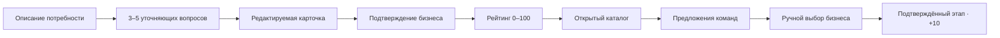
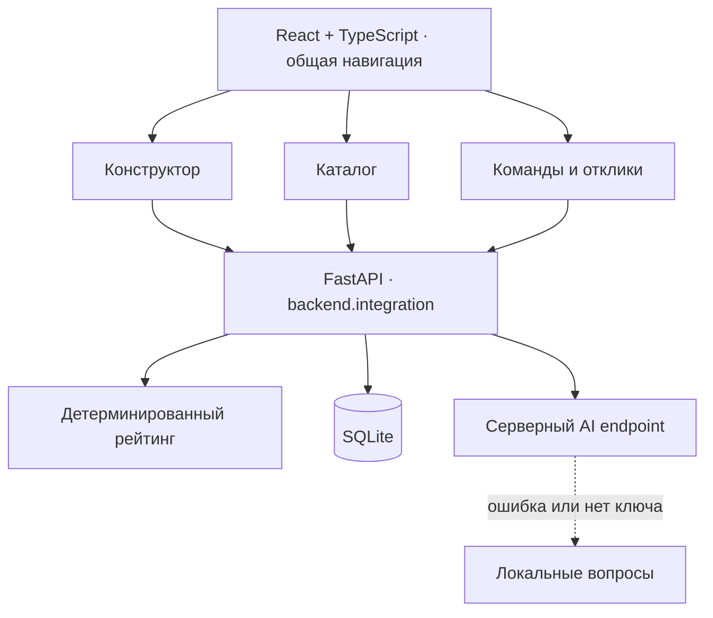

<p align="center">
  
</p>

<p align="center">
  <a href="https://github.com/BAITC-Hacks/hack-6d4719b0-i-got-love/actions/workflows/ci.yml"></a>
  
  
  
  
</p>

<p align="center"><strong>Бизнес формулирует задачу. Команды предлагают решения. Результат подтверждает человек.</strong></p>
<p align="center"><a href="#быстрый-запуск">Запустить</a> · <a href="#как-это-работает">Возможности</a> · <a href="#демо-за-пять-минут">Сценарий демо</a> · <a href="#архитектура">Архитектура</a> · <a href="#проверки">Проверки</a></p>

Lovelab превращает короткое описание бизнес-проблемы в задачу, с которой студенческая команда может начать работу. Уточняющие вопросы помогают заполнить карточку, прозрачный рейтинг показывает её готовность, а открытый каталог соединяет бизнес и команды.

Проект создан для [кейса AI Sana / HackAlem](https://docs.google.com/document/d/1lFWekP2SirFarATKkWa5neHNL5DlhjZKkUacvGyZk8k/edit). Сквозной сценарий работает в приложении: от первого описания до отклика, ручного выбора команды и начисления баллов.

## Как это работает



| Для бизнеса | Для команды |
| --- | --- |
| Описать проблему своими словами и получить вопросы | Найти задачу по теме, уровню и поисковому запросу |
| Сохранить черновик и вернуться к нему позже | Прочитать полную карточку и увидеть недостающие сведения |
| Увидеть разбивку рейтинга и дополнить карточку | Предложить идею, план, срок и ссылку на прототип |
| Сравнить отклики, выбрать несколько команд или отклонить предложения | Получить 10 баллов после подтверждённого этапа |
| Уточнить опубликованную задачу с пересчётом рейтинга | Видеть накопленные баллы в профиле команды |

**Два независимых счёта:** рейтинг задачи оценивает полноту подтверждённого описания; баллы команды отмечают фактический прогресс. Подтверждение этапа не меняет рейтинг задачи. Задача с **0 баллов** остаётся видна и принимает отклики.

## Интерфейс

### Каталог с прозрачным рейтингом


<details>
<summary><strong>Конструктор: карточка, подтверждение и расшифровка баллов</strong></summary>


</details>

<details>
<summary><strong>Отклики: сравнение идей и ручной выбор команд</strong></summary>


</details>

Скриншоты сняты с работающего приложения на синтетической базе. Интерфейс также доступен на узком экране; адрес выбранной задачи сохраняется в URL, а незавершённый ввод конструктора — в браузере.

## Быстрый запуск

Нужны **Node.js 22.12+** и **Python 3.10+**. Внешний AI-ключ необязателен: без него доступны локальные вопросы и весь демонстрационный сценарий. Для установки зависимостей нужен интернет.

### macOS / Linux

```bash
git clone https://github.com/BAITC-Hacks/hack-6d4719b0-i-got-love.git
cd hack-6d4719b0-i-got-love

npm ci
python3 -m venv .venv
source .venv/bin/activate
python -m pip install -r requirements.txt

npm run demo
```

### Windows · PowerShell

```powershell
git clone https://github.com/BAITC-Hacks/hack-6d4719b0-i-got-love.git
cd hack-6d4719b0-i-got-love

npm ci
py -m venv .venv
.\.venv\Scripts\Activate.ps1
python -m pip install -r requirements.txt

npm run demo
```

Если PowerShell блокирует активацию окружения, можно обойтись без неё:

```powershell
.\.venv\Scripts\python.exe -m pip install -r requirements.txt
npm run build
.\.venv\Scripts\python.exe scripts/demo.py
```

Откройте **[http://127.0.0.1:8000](http://127.0.0.1:8000)**. Команда собирает интерфейс, готовит демонстрационные данные и запускает интерфейс вместе с API на одном порту. Повторный запуск сохраняет задачи, решения и баллы. Остановка — `Ctrl+C`.

| Адрес | Что находится |
| --- | --- |
| `/` | Приложение Lovelab |
| `/#builder` | Конструктор и сохранённые задачи |
| `/#proposals?task=7` | Пять демонстрационных откликов |
| `/docs` | Интерактивная документация FastAPI |
| `/api/health` | Проверка доступности API и базы |

Для другого порта после сборки: `python scripts/demo.py --port 8080`.

Для проверки с устройств друзей в той же локальной сети:

```bash
python scripts/demo.py --host 0.0.0.0 --port 8000
```

На другом устройстве откройте `http://<локальный-IP-вашего-компьютера>:8000`. Компьютер с сервером должен оставаться включённым; адрес `localhost` на телефоне указывает на сам телефон.

### Режим разработки

После установки зависимостей и активации `.venv` подготовьте данные:

```bash
python -m backend.seed
python -m backend.team_proposals
```

В первом терминале с активным Python-окружением:

```bash
npm run dev:api
```

Во втором терминале:

```bash
npm run dev
```

Vite покажет адрес интерфейса и перенаправит `/api` на `127.0.0.1:8000`. Работайте из корня репозитория — он объединяет все модули. `pnpm` также поддерживается: замените `npm ci` на `pnpm install --frozen-lockfile`, остальные команды — на `pnpm run …`.

## Демо за пять минут

| Время | Действие | Что показать |
| --- | --- | --- |
| 0:00–0:40 | Конструктор → «Новая задача». Ввести: «Менеджеры долго отвечают на обращения клиентов» | Исходная потребность без придуманных деталей |
| 0:40–1:30 | Получить вопросы, ответить, создать черновик и указать название | Не менее трёх вопросов; ответы переносятся дословно |
| 1:30–2:15 | Сохранить, подтвердить карточку, открыть разбивку рейтинга | Баллы начисляются за подтверждённые поля; виден список пробелов |
| 2:15–2:45 | Опубликовать и перейти в каталог | Задача доступна, включая низкий рейтинг; работают фильтры |
| 2:45–3:40 | Откликнуться: команда, идея, план, срок и ссылка | Реальное предложение сохраняется в базе |
| 3:40–4:20 | Выбрать команду и подтвердить этап | Команда получает +10; после обновления баллы сохраняются |
| 4:20–5:00 | Отредактировать опубликованную задачу и подтвердить дополнение | Рейтинг меняется, задача и отклики остаются доступны |

Для быстрого заполнения можно взять ответы:

| Поле | Пример |
| --- | --- |
| Потребность | Сократить время первого ответа |
| Пользователи | Операторы поддержки |
| Результат | Прототип распределения обращений по темам |
| Критерии успеха | Первый ответ в течение 10 минут |
| Данные | Обезличенная история обращений |
| Название | Быстрая поддержка |

Вместе с исходным контекстом эти поля дают **80 / 100** после подтверждения. Добавьте ограничения — получите **90 / 100**. Контакт и формат взаимодействия доведут карточку до **100 / 100**.

Чтобы сразу сравнить пять предложений, выберите в «Откликах» задачу **Shorten support replies** (`#7`). Можно выбрать несколько команд, отклонить одну или оставить все решения на рассмотрении. Ссылки `example.com` в исходных предложениях — демонстрационные.

## Рейтинг: за что начисляются баллы

Формула находится в [`backend/rating.py`](backend/rating.py). В MVP непустое поле после удаления пробелов получает свой вес. Оценка полноты детерминирована: AI не выставляет баллы и не оценивает достоверность обещаний бизнеса.

| Критерий | Максимум | Начисление |
| --- | ---: | --- |
| Контекст и потребность | 20 | По 10 за каждое поле |
| Данные и материалы | 20 | Доступные данные, примеры или источники |
| Ожидаемый результат | 15 | Что команда должна подготовить |
| Критерии успеха | 15 | По чему бизнес примет результат |
| Ограничения | 10 | Сроки, технологии, доступы и другие границы |
| Пользователи | 10 | Для кого создаётся решение |
| Связь с бизнесом | 10 | Контакт — 5, формат взаимодействия — 5 |
| **Итого** | **100** | Только подтверждённые сведения |

| 0–39 | 40–69 | 70–89 | 90–100 |
| --- | --- | --- | --- |
| Черновик | Рабочая | Готовая | Приоритетная |

Уровень «Черновик» — характеристика полноты, а статус `draft` — состояние публикации. **Опубликованная** задача может иметь уровень «Черновик» и оставаться доступной всем командам.

До подтверждения карточка имеет рейтинг 0; интерфейс отдельно показывает предварительную оценку. Сохранение правок черновика сбрасывает подтверждение. Для опубликованной карточки кнопка «Подтвердить и опубликовать изменения» атомарно сохраняет новые поля и рейтинг, сохраняя публикацию и отклики.

## AI: вопросы без выдуманных фактов

Сервер отправляет провайдеру только введённое описание и системный промпт. Ответ должен содержать **3–5 вопросов по различным полям**. Карточка собирается из исходного контекста и ответов пользователя; неизвестные сведения остаются пустыми.

```json
{
  "questions": [
    { "field": "need", "text": "Какую потребность бизнеса нужно закрыть?" },
    { "field": "users", "text": "Кто будет пользоваться результатом?" },
    { "field": "success_criteria", "text": "Как вы измерите успех?" }
  ]
}
```

Полный промпт `QUESTION_PROMPT`, формат запроса и проверка ответа доступны в [`task_builder/server.py`](task_builder/server.py). Ввод API: `POST /api/task-builder/questions` с телом `{"description":"…"}`. Ответ включает `questions`, `source` (`external` или `local`) и `warning`.

При отсутствии настроек, таймауте, сетевой ошибке, некорректном JSON или неправильных полях сервер возвращает пять локальных вопросов. Интерфейс явно сообщает о переходе к локальным вопросам; сценарий продолжается.

Для внешнего провайдера задайте переменные **в окружении сервера**:

| Переменная | Назначение |
| --- | --- |
| `AI_API_URL` | Полный URL endpoint с форматом Chat Completions |
| `AI_API_KEY` | Секретный ключ провайдера |
| `AI_MODEL` | Название доступной модели |
| `APP_DB_PATH` | Необязательный путь к SQLite; по умолчанию `backend/app.db` |

См. [`.env.example`](.env.example). Файл `.env` **не загружается автоматически**: экспортируйте значения в оболочке или передайте процессу сервера. Не используйте префикс `VITE_` для секретов. Реальный AI-вызов требует вашего провайдера; автоматические проверки используют локальный fallback.

## Архитектура



```text
src/                           Общая оболочка, команды и отклики
frontend/src/                  Каталог, фильтры и полные карточки
task_builder/frontend/src/     Конструктор и восстановление ввода
task_builder/server.py         Черновики, подтверждение, публикация, AI
backend/
  integration.py               Единый API, health и раздача сборки
  db.py · schema.sql           Хранилище и схема SQLite
  rating.py · main.py          Рейтинг и API каталога
  team_proposals.py            Команды, решения и начисление баллов
  seed.py                      Синтетические задачи
scripts/                       Запуск демо и изолированного тестового API
tests/                         Браузерные сценарии Playwright
docs/                          Обложка и реальные скриншоты
```

`Task` хранит описание, статус и подтверждение; `Proposal` связывает задачу и команду; `Team` хранит профиль и накопленные баллы. Ограничения внешних ключей включены. Подтверждение этапа и изменение баллов выполняются в одной SQLite-транзакции с блокировкой записи: повторные и одновременные запросы не удваивают награду.

Основные маршруты, тела запросов и ответы описаны в [`API_CONTRACT.md`](API_CONTRACT.md); живую OpenAPI-схему можно открыть на `/docs`.

## Данные и границы MVP

Свежая демонстрационная база содержит **5 черновиков, 5 опубликованных задач, 5 команд и 5 откликов**. Рейтинги начальных карточек: **0, 30, 50, 75, 100**. Данные синтетические; подготовка не перезаписывает существующие таблицы с данными.

Это общее демо-пространство: регистрации и разграничения прав нет, действия бизнеса и команд доступны в одном интерфейсе. Для публичного многопользовательского развёртывания нужна отдельная авторизация. Чат, уведомления, файловое хранилище и автоматическое назначение команд не входят в кейс.

У выбранного отклика один подтверждаемый этап. Принятое решение нельзя поменять на другое; подтверждённые баллы нельзя отозвать через интерфейс. Текущие правки конструктора сохраняются в `localStorage` этого браузера, а сохранённые карточки и отклики — в SQLite.

Для новой демонстрации используйте **новый путь `APP_DB_PATH`**, сохранив текущую базу:

```bash
# macOS / Linux, при активном .venv
APP_DB_PATH=backend/fresh-demo.db python scripts/demo.py
```

```powershell
# Windows PowerShell, при активном .venv
$env:APP_DB_PATH = "backend/fresh-demo.db"
python scripts/demo.py
```

Откройте новую базу в приватном окне браузера, чтобы не восстановить черновики предыдущей демонстрации из локального хранилища.

## Проверки

```bash
# Активируйте .venv перед Python-командами
python -m pip install -r requirements-dev.txt
python -m unittest discover -v
npm run build

# Реальный браузер + API + отдельная временная база
npx playwright install chromium
npm run test:e2e
```

Проверяется весь путь до подтверждения этапа, повторная публикация, пересчёт рейтинга, отклики на задачи с нулём баллов, отклонение некорректного AI-ответа, гонки сохранения/публикации и одновременного начисления награды. Браузерные проверки дополнительно проходят восстановление ввода после перезагрузки, навигацию, несколько выбранных команд, пустые данные, сетевую ошибку и узкий экран.

Тесты используют временные базы и не изменяют `backend/app.db`. GitHub Actions повторяет Python-проверки, сборку и браузерные сценарии на каждом push и pull request. Для обновления скриншотов в macOS/Linux: `CAPTURE_DOCS=1 npm run test:e2e`.

<details>
<summary><strong>Если что-то не запустилось</strong></summary>

| Симптом | Что проверить |
| --- | --- |
| `No module named fastapi` / `uvicorn` | Активирован ли `.venv`, выполнена ли установка Python-зависимостей |
| `python: command not found` | Создайте окружение через `python3`, затем активируйте `.venv` |
| Главная страница возвращает 503 | Выполните `npm run build`, затем перезапустите API, либо используйте `npm run demo` |
| Порт 8000 занят | Запустите `python scripts/demo.py --port 8080` |
| Пустые команды или каталог в режиме разработки | Выполните обе команды подготовки: `backend.seed` и `backend.team_proposals` |
| Конструктор сохраняет в другую базу | Уберите старую переменную `TASK_BUILDER_DB_PATH`; для общего приложения используйте только `APP_DB_PATH` |
| Показаны локальные вопросы | Нормальный режим без AI-ключа; для внешнего AI проверьте три серверные переменные |
| Playwright не находит браузер | Выполните `npx playwright install chromium` |

</details>

## Команда и история интеграции

| Участник | Область | Исходный PR |
| --- | --- | --- |
| [Zhanb6](https://github.com/Zhanb6) | Конструктор задач и AI | [#2](https://github.com/BAITC-Hacks/hack-6d4719b0-i-got-love/pull/2) |
| [defjavadev](https://github.com/defjavadev) | Схема данных, рейтинг и каталог | [#1](https://github.com/BAITC-Hacks/hack-6d4719b0-i-got-love/pull/1) |
| [aldaiq1234](https://github.com/aldaiq1234) | Команды, отклики и ручное решение бизнеса | [#3](https://github.com/BAITC-Hacks/hack-6d4719b0-i-got-love/pull/3) |

Исходные PR объединены с сохранением авторских коммитов. Договорённости и критерии готовности — в [`TEAM_PLAN.md`](TEAM_PLAN.md).
