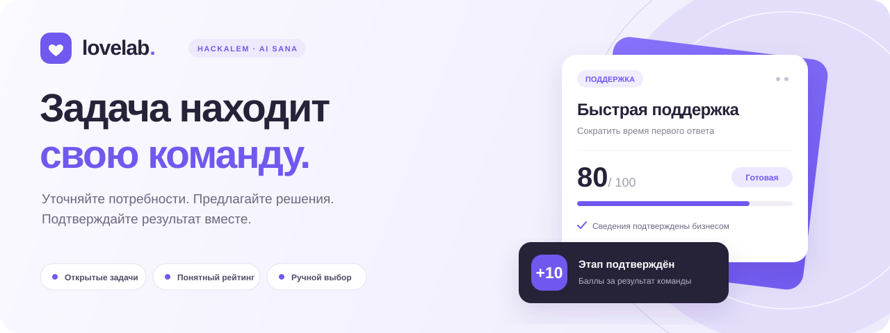
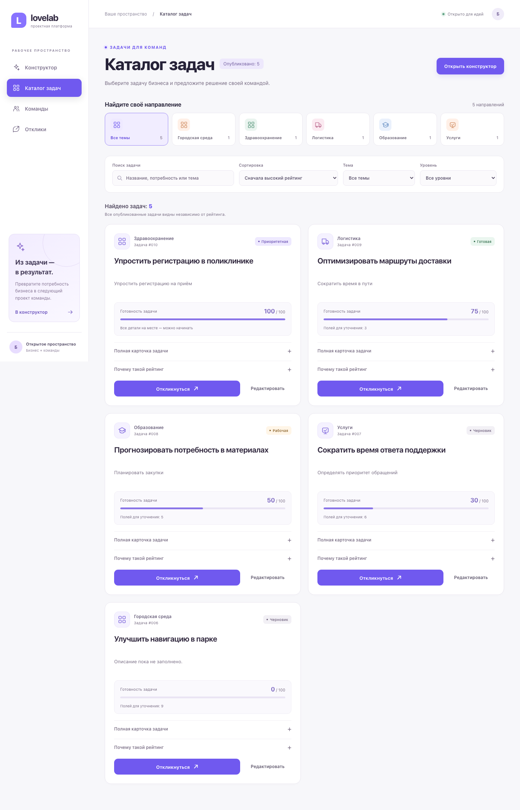
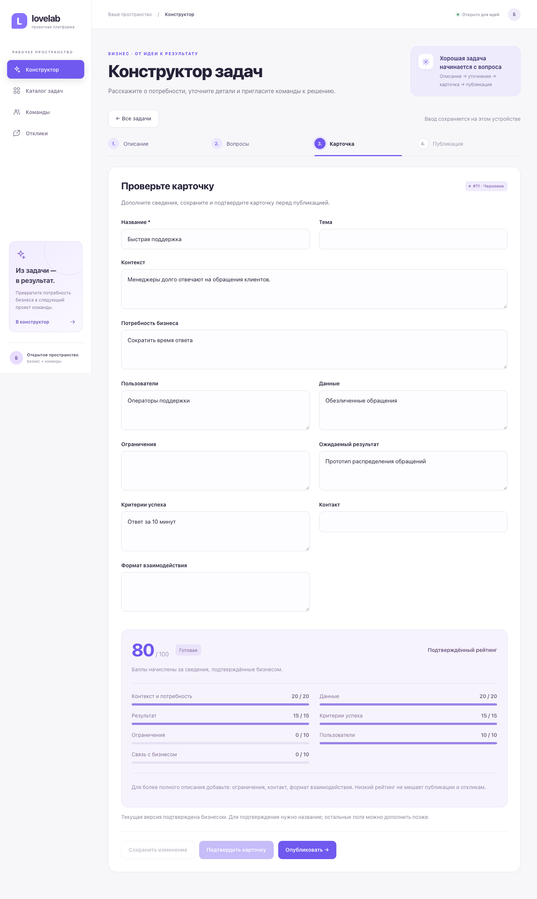
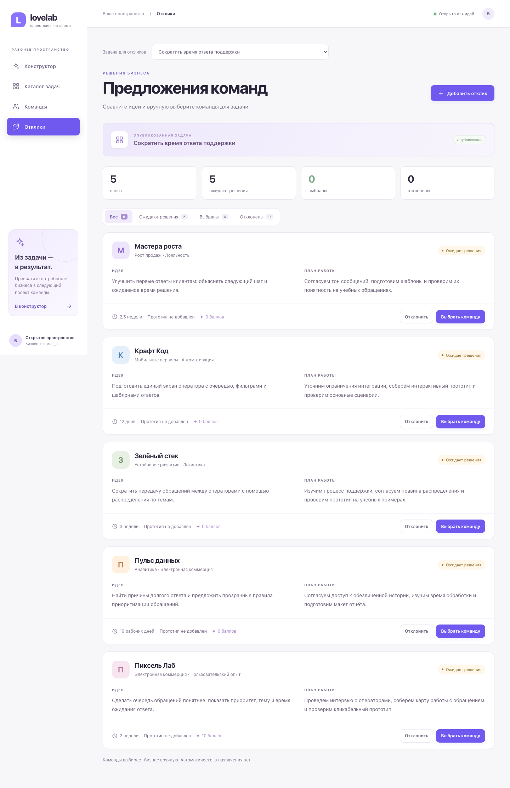
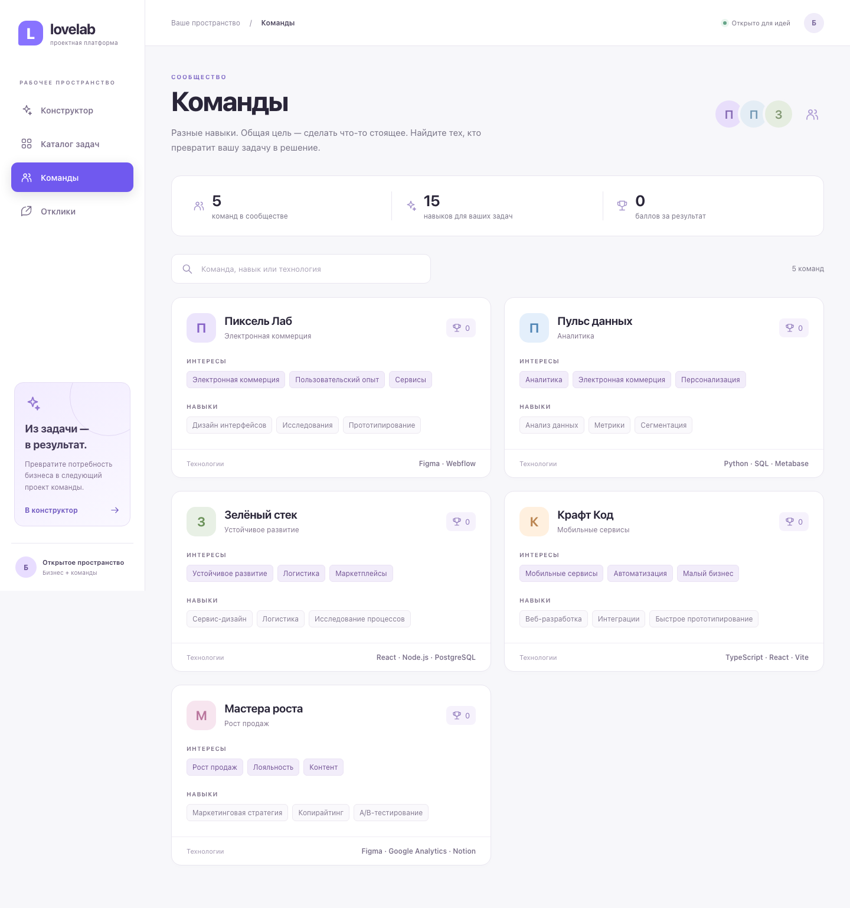
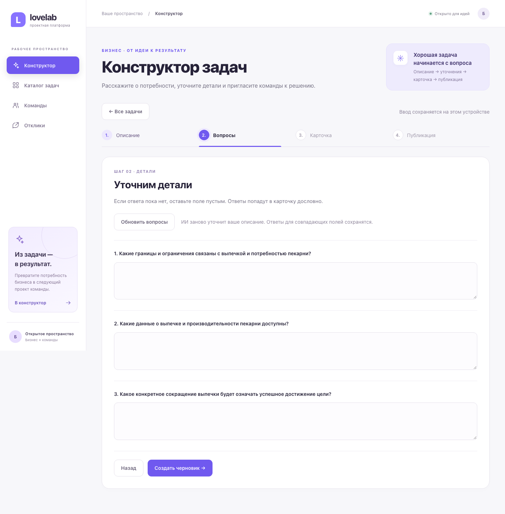
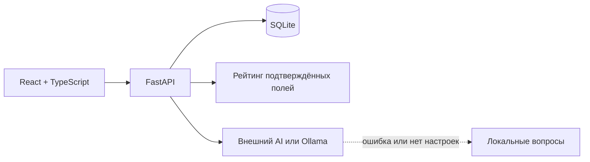

<p align="center">
  
</p>

<p align="center">
  
  
  
  
</p>

<p align="center"><strong>Из короткого описания проблемы — в понятную задачу, предложение команды и подтверждённый результат.</strong></p>
<p align="center"><a href="#интерфейс">Посмотреть</a> · <a href="#быстрый-запуск">Запустить</a> · <a href="#демо-за-пять-минут">Провести демо</a> · <a href="#как-считается-рейтинг">Понять рейтинг</a> · <a href="#проверки">Проверить</a></p>

Бизнесу бывает трудно объяснить, что именно нужно сделать. Команде — понять, достаточно ли информации для начала работы. **Lovelab** помогает им встретиться: задаёт уточняющие вопросы, показывает пробелы в описании и открывает задачу для предложений.

Создано для [кейса AI Sana / HackAlem](https://docs.google.com/document/d/1lFWekP2SirFarATKkWa5neHNL5DlhjZKkUacvGyZk8k/edit). В приложении работает весь путь: **описание → вопросы → карточка → подтверждение → каталог → отклик → выбор команды → +10 за этап**.

| Бизнес | Команда |
| --- | --- |
| Уточняет задачу и видит, чего не хватает | Находит задачи по теме, уровню и поиску |
| Сохраняет черновик и возвращается к нему позже | Изучает полную карточку и расшифровку рейтинга |
| Сравнивает предложения и выбирает одну или несколько команд | Предлагает идею, план, срок и ссылку на прототип |
| Подтверждает фактический прогресс | Получает баллы за подтверждённый этап |

**Рейтинг задачи и баллы команды независимы.** Даже задача с 0 / 100 видна в каталоге и принимает отклики. Решение о выборе команды всегда принимает человек.

## Интерфейс

**Каталог.** Полная картина задачи: готовность, тема, недостающие сведения и следующий шаг.



<details>
<summary><strong>Конструктор — от исходной потребности до подтверждённой карточки</strong></summary>



</details>

<details>
<summary><strong>Отклики — сравнение предложений и ручной выбор команд</strong></summary>



</details>

<details>
<summary><strong>Команды — навыки, интересы и подтверждённые результаты</strong></summary>



</details>

<details>
<summary><strong>AI — реальные уточняющие вопросы локальной модели</strong></summary>



</details>

Это скриншоты работающего приложения на синтетических данных. Интерфейс адаптирован к узкому экрану; выбранная задача отражается в URL, незавершённый ввод конструктора сохраняется в браузере.

## Быстрый запуск

Нужны **Node.js 22.12+**, **Python 3.10+** и интернет для установки зависимостей. AI-ключ необязателен: локальные вопросы позволяют пройти весь сценарий сразу.

### macOS / Linux

```bash
git clone https://github.com/BAITC-Hacks/hack-6d4719b0-i-got-love.git
cd hack-6d4719b0-i-got-love
npm ci
python3 -m venv .venv
source .venv/bin/activate
python -m pip install -r requirements.txt
npm run demo
```

### Windows · PowerShell

Команды используют Python из окружения напрямую и не требуют разрешать выполнение `Activate.ps1`.

```powershell
git clone https://github.com/BAITC-Hacks/hack-6d4719b0-i-got-love.git
cd hack-6d4719b0-i-got-love
npm ci
py -m venv .venv
.\.venv\Scripts\python.exe -m pip install -r requirements.txt
npm run build
.\.venv\Scripts\python.exe scripts/demo.py
```

Откройте **[http://127.0.0.1:8000](http://127.0.0.1:8000)**. Интерфейс и API работают на одном порту. Скрипт готовит демонстрационную базу; повторный запуск сохраняет карточки, решения и баллы. Остановка — `Ctrl+C`.

| Адрес | Назначение |
| --- | --- |
| `/` | Каталог Lovelab |
| `/#builder` | Конструктор и сохранённые карточки |
| `/#proposals?task=7` | Пять демонстрационных откликов |
| `/docs` · `/api/health` | Документация API · проверка API и базы |

После сборки другой порт задаётся через `python scripts/demo.py --port 8080`. В Windows без активации заменяйте `python` на `.\.venv\Scripts\python.exe` во всех дальнейших командах.

<details>
<summary><strong>Показать друзьям в одной локальной сети</strong></summary>

```bash
python scripts/demo.py --host 0.0.0.0 --port 8000
```

На другом устройстве откройте `http://<локальный-IP-компьютера>:8000`. Сервер должен оставаться включённым; `localhost` на телефоне означает сам телефон. Это общее демо-пространство без разграничения прав.

</details>

### Режим разработки

Из корня репозитория, с активным `.venv`, подготовьте данные и запустите API:

```bash
python -m backend.seed
python -m backend.team_proposals
npm run dev:api
```

Во втором терминале выполните `npm run dev` и откройте адрес Vite. Запросы `/api` перенаправляются на `127.0.0.1:8000`. Без активации окружения API можно запустить напрямую: `.\.venv\Scripts\python.exe -m uvicorn backend.integration:app --reload --port 8000`.

Доступен и `pnpm`: установка — `pnpm install --frozen-lockfile`, остальные команды — `pnpm run …`.

Существующие демонстрационные записи переводятся на русский при запуске `scripts/demo.py`. Пользовательские правки, статусы и баллы сохраняются. При запуске API отдельно выполните `python -m backend.localize_demo`.

## Демо за пять минут

| Время | Действие | Что видно |
| --- | --- | --- |
| 0:00–0:40 | Конструктор → «Новая задача». Ввести: «Менеджеры долго отвечают на обращения клиентов» | Исходная бизнес-потребность |
| 0:40–1:30 | Получить вопросы, ответить, создать черновик и указать название | Не менее трёх вопросов; неизвестные поля остаются пустыми |
| 1:30–2:15 | Сохранить и подтвердить карточку | Рейтинг и объяснение каждого начисления |
| 2:15–2:45 | Опубликовать и открыть каталог | Задача доступна независимо от рейтинга |
| 2:45–3:40 | Отправить отклик: команда, идея, план, срок, ссылка | Предложение сохраняется в базе |
| 3:40–4:20 | Выбрать команду, подтвердить этап, обновить страницу | Команда получает ровно +10 |
| 4:20–5:00 | Дополнить опубликованную карточку и подтвердить изменения | Рейтинг пересчитан; задача и отклики на месте |

У пяти начальных откликов нет настоящих прототипов: вместо внешней ссылки показано «Прототип не добавлен». В новых откликах укажите ссылку на свой проект.

**Готовый пример для заполнения:**

| Поле | Ответ |
| --- | --- |
| Название | Быстрая поддержка |
| Потребность | Сократить время первого ответа |
| Пользователи | Операторы поддержки |
| Результат | Прототип распределения обращений по темам |
| Критерии успеха | Первый ответ в течение 10 минут |
| Данные | Обезличенная история обращений |

С исходным контекстом получится **80 / 100**. Добавьте ограничения — **90 / 100**, контакт и формат взаимодействия — **100 / 100**.

Для готового сравнения откройте задачу **Сократить время ответа поддержки (#7)** в «Откликах»: там пять предложений. Можно выбрать несколько команд, отклонить предложение или оставить решение на рассмотрении. Исходные ссылки `example.com` — демонстрационные.

## Как считается рейтинг

[Формула](backend/rating.py) оценивает полноту **подтверждённых** сведений. Каждое непустое после удаления пробелов поле получает свой вес; название и тема баллов не дают. AI не оценивает качество или достоверность описания.

| Критерий | Баллы |
| --- | ---: |
| Контекст и потребность | 10 + 10 |
| Данные и материалы | 20 |
| Ожидаемый результат | 15 |
| Критерии успеха | 15 |
| Ограничения | 10 |
| Пользователи | 10 |
| Контакт и формат взаимодействия | 5 + 5 |
| **Максимум** | **100** |

| 0–39 | 40–69 | 70–89 | 90–100 |
| --- | --- | --- | --- |
| Черновик | Рабочая | Готовая | Приоритетная |

До подтверждения рейтинг равен 0, а предварительная оценка показана отдельно. Сохранение изменений черновика сбрасывает подтверждение. Кнопка «Подтвердить и опубликовать изменения» сохраняет правки опубликованной карточки и новый рейтинг в одной транзакции; отклики сохраняются.

Уровень «Черновик» описывает полноту, статус `draft` — состояние публикации. **Опубликованная карточка любого уровня остаётся в каталоге.** Подтверждение этапа даёт выбранной команде +10 один раз и не меняет рейтинг задачи, в том числе при повторных или одновременных запросах.

## AI и локальные вопросы

Сервер отправляет описание и системный промпт внешнему провайдеру или локальной модели Ollama; ожидает **3–5 вопросов по разным полям**. Карточка собирается из исходного описания и ответов пользователя. Промпт `QUESTION_PROMPT`, JSON-схема ответа и валидация находятся в [`task_builder/server.py`](task_builder/server.py).

```json
{"questions": [
  {"field": "need", "text": "Какую потребность бизнеса нужно закрыть?"},
  {"field": "users", "text": "Кто будет пользоваться результатом?"},
  {"field": "success_criteria", "text": "Как вы измерите успех?"}
]}
```

Для AI без внешнего ключа запустите Ollama с установленной моделью и передайте её имя серверу. Например, для уже установленной `dolphin-llama3:8b`:

```bash
# macOS / Linux, с активным .venv; Ollama уже запущена
OLLAMA_MODEL=dolphin-llama3:8b python scripts/demo.py
```

В PowerShell: `$env:OLLAMA_MODEL = "dolphin-llama3:8b"`, затем обычная команда запуска. При первом обращении загрузка модели может занять до минуты. Запросы к Ollama используют JSON-схему ответа; описание остаётся на вашем компьютере при стандартном локальном адресе.

Полностью заданные `AI_API_URL`, `AI_API_KEY`, `AI_MODEL` включают внешний провайдер и имеют приоритет. Иначе используется `OLLAMA_MODEL`. Без конфигурации, при недоступности модели или неправильном ответе возвращаются **пять стандартных вопросов**; сообщение объясняет конкретную причину. **Локальная генерация проверена на реальной модели** на описаниях пекарни и службы поддержки, в интерфейсе и через публичную HTTPS-ссылку. В этих проверках прогретая модель отвечала за 2–3 секунды. **Вызов реального внешнего провайдера не проверен.** Автотесты проверяют оба формата запросов и ошибки с имитацией ответов, без загрузки модели.

| Серверная переменная | Значение |
| --- | --- |
| `AI_API_URL` | Полный URL endpoint в формате Chat Completions |
| `AI_API_KEY` | Секретный ключ провайдера |
| `AI_MODEL` | Название модели |
| `OLLAMA_MODEL` | Имя установленной локальной модели |
| `OLLAMA_BASE_URL` | Адрес Ollama; по умолчанию `http://127.0.0.1:11434` |
| `APP_DB_PATH` | Путь к SQLite; по умолчанию `backend/app.db` |

[`.env.example`](.env.example) — пример, **`.env` автоматически не загружается**. Передайте значения в окружение серверного процесса. Ключ хранится только на сервере; префикс `VITE_` для него не используется.

## Архитектура



| Код | Ответственность |
| --- | --- |
| `src/` | Оболочка, навигация, команды и отклики |
| `frontend/src/` | Каталог, фильтры, полная карточка |
| `task_builder/frontend/src/` · `task_builder/server.py` | Конструктор, восстановление ввода, вопросы и публикация |
| `backend/integration.py` | Общий API, health и раздача сборки |
| `backend/db.py` · `schema.sql` · `rating.py` | SQLite, модель данных и формула рейтинга |
| `backend/team_proposals.py` | Предложения, решения и однократное начисление баллов |
| `scripts/` · `tests/` | Запуск демо, изолированный API и браузерные проверки |

`Task` содержит задачу и её подтверждение, `Proposal` связывает её с `Team`. SQLite хранит карточки, отклики и баллы; `localStorage` — незавершённый ввод на устройстве. Внешние ключи включены. Публикация, подтверждённые изменения и награды защищены транзакциями. Полный контракт — в [`API_CONTRACT.md`](API_CONTRACT.md), интерактивная схема — на `/docs`.

## Данные и границы MVP

Свежая база: **5 черновиков · 5 опубликованных задач · 5 команд · 5 откликов**. Начальные рейтинги: **0, 30, 50, 75, 100**. Данные синтетические; повторная подготовка сохраняет существующие данные.

Регистрации и разграничения прав нет: бизнес и команды работают в общем демо-пространстве. Чат, уведомления, файловое хранилище и автоматическое назначение команд не входят в кейс. У выбранного отклика один подтверждаемый этап; принятое решение нельзя заменить другим, начисленные баллы нельзя отозвать через интерфейс.

Для чистого демо задайте **новый** путь к базе и откройте приватное окно браузера — текущие данные останутся на месте:

```bash
# macOS / Linux, с активным .venv
APP_DB_PATH=backend/fresh-demo.db python scripts/demo.py
```

```powershell
# Windows PowerShell
$env:APP_DB_PATH = "backend/fresh-demo.db"
.\.venv\Scripts\python.exe scripts/demo.py
```

## Проверки

```bash
# Python из .venv; в Windows можно использовать полный путь выше
python -m pip install -r requirements-dev.txt
python -m unittest discover -v
npm run build
npx playwright install chromium
npm run test:e2e
```

Python-тесты проверяют HTTP-сценарий, пересчёт рейтинга, повторную публикацию, низкорейтинговые задачи, некорректные AI-ответы и гонки публикации/награждения. Playwright проходит реальный интерфейс: восстановление ввода, несколько выбранных команд, пустые данные, сетевые ошибки и мобильный экран. Используются временные базы, `backend/app.db` не меняется.

[GitHub Actions](https://github.com/BAITC-Hacks/hack-6d4719b0-i-got-love/actions/workflows/ci.yml) настроен на push и pull request. **На 23 сентября 2026 запуск CI заблокирован биллингом аккаунта GitHub; успешный удалённый прогон не подтверждён.** Проверки можно воспроизвести локально командами выше. Обновить скриншоты в macOS/Linux: `CAPTURE_DOCS=1 npm run test:e2e`.

<details>
<summary><strong>Если что-то не запустилось</strong></summary>

| Симптом | Решение |
| --- | --- |
| Нет `python`, `fastapi` или `uvicorn` | Используйте Python из `.venv` и установите `requirements.txt` |
| Главная возвращает 503 | Выполните `npm run build` и перезапустите API |
| Порт занят | Добавьте `--port 8080` при запуске `scripts/demo.py` |
| Пустой каталог или команды | Выполните обе команды подготовки: `backend.seed` и `backend.team_proposals` |
| Конструктор сохраняет отдельно | Уберите `TASK_BUILDER_DB_PATH`, используйте общий `APP_DB_PATH` |
| Playwright не находит браузер | Выполните `npx playwright install chromium` |

</details>

## Команда

| Участник | Область | Исходный PR |
| --- | --- | --- |
| [Zhanb6](https://github.com/Zhanb6) | Конструктор и AI | [#2](https://github.com/BAITC-Hacks/hack-6d4719b0-i-got-love/pull/2) |
| [defjavadev](https://github.com/defjavadev) | Данные, рейтинг и каталог | [#1](https://github.com/BAITC-Hacks/hack-6d4719b0-i-got-love/pull/1) |
| [aldaiq1234](https://github.com/aldaiq1234) | Команды, отклики и решения бизнеса | [#3](https://github.com/BAITC-Hacks/hack-6d4719b0-i-got-love/pull/3) |

PR объединены с сохранением авторских коммитов. Критерии кейса и зоны ответственности — в [`TEAM_PLAN.md`](TEAM_PLAN.md).
